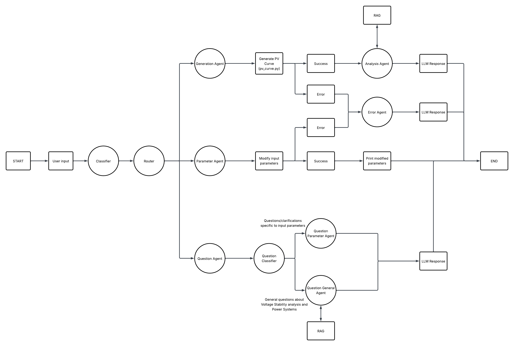

# AI Agent

AI Agent which creates PV curves or answers Voltage Stability related requests using LLMs and RAG.

## Current Agentic Workflow



### Brief summary of workflow:

First, the user is queried for input, where a classification node determines whether the response is a question, input modification, or pv curve generation. Upon LLM determination from the context, the router node determines which node to execute next and passes the context. If routed to an input modification, the LLM determines the inputs to modify and the values from the message and modifies the input(s) accordingly, ending the response and leading to a new input request. If a general question or request is asked, the LLM will be given RAG context on PV Curves and Voltage Stability to generate a response. If a PV curve is signaled to be generated, then `pv_curve.py` will be ran and the results will be passed into the Analysis node, using RAG context to generate a response about the data. This is an endless loop until cancelled.

### Potential improvements:

- Separate RAG agents to different nodes with smaller vector databases (i.e. analysis database, general voltage stability question database, questions about agent/repo database, etc.)
- Add Error node, determining the cause of failure and responding to the user with feedback instead of breaking flow.

## TODO

- [ ] `/pv_curve`
- [X] Improve `Modelfile`
- [ ] Improve documentation
- [ ] Improve prompting `prompts.py` and classification model
- [X] Create visual map of nodes
- [ ] Consider instead of just answering questions about PV-curves generally to fetch guidelines, explain parameters, etc. (Add more nodes to LangGraph)
- [ ] Multiple DBs/RAG sources depending on usage (Explanation, Analysis, etc.)
- [ ] Add Error handling/analysis node
- [ ] Make inputs less involved and use more natural language, where the AI can determine the parameter values based on RAG context

## Installation & Run

Run Agent locally:

```bash
cd /agent
python -m venv venv
source venv/bin/activate  # Windows: venv\Scripts\activate
pip install -r requirements.txt
python main.py
```
